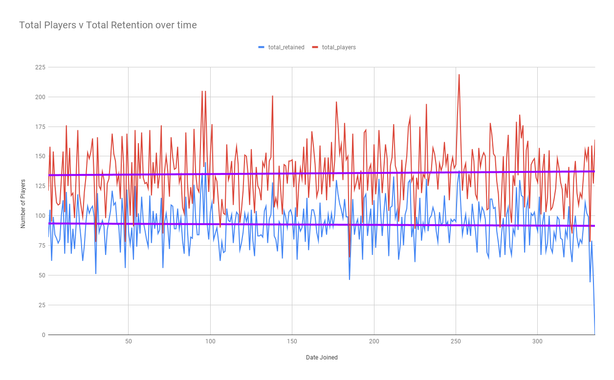
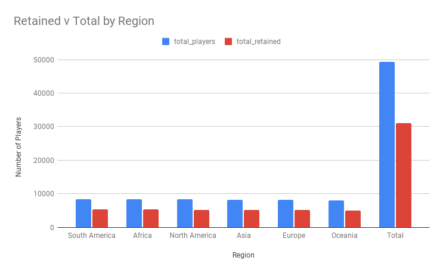
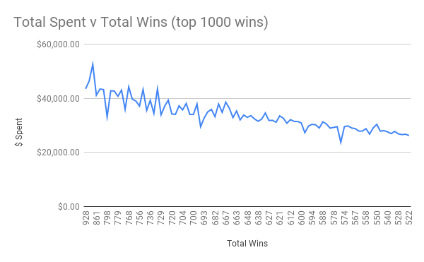

# SQL Project 1

## Introduction

Project Members: Jamie Hoffele and Sasha Girling

For this project we had a set of fictional data from a "Game Company" that was seeking out its rolling retention numbers by day. The selection would be binary, either players were retained if they played a match within 30 days of sign up, or they were not. We used our first query to connect the tables and create a data set we could use and import into Google Sheets, where we added columns and formula to calculate the percentage retained, which felt high but confirmed throughout the dataset.

In sheets we then used this data to create charts and visualizations to track the trend lines in retention which seemed steady, and confirmed this by comparing retention across regions where they were all relatively the same percentages within a 1.5% margin of error.

From here we wondered if player spending impacted retention, and found that those players in the top 1000 of wins would spend more within the game itself and this lowered over the lower number of wins which means the game might be considered "pay-to-win".

### Links

Google Presentation Link(also available as a PDF in this repo): https://docs.google.com/presentation/d/1eOCHpzo7nJLOCbuE4pMNXL4R0naUozoxsNJg7tH5E4g/edit?usp=sharing

Google sheets Link: https://docs.google.com/spreadsheets/d/1HNTCJTQU66bNhSnMctU5x1X5nzFwPG8vqw8xgVF9e9s/edit?usp=sharing
